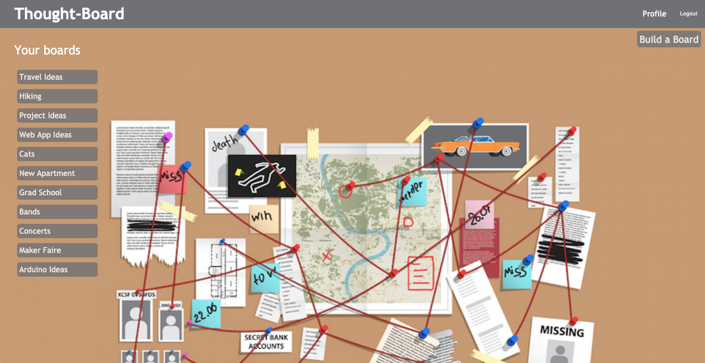

## Welcome to Thought-Board LABS

Here at Thought-Board LABS, we believe in the value of visualizing your thoughts.  This project aims to allow our users to build a virtual board on which they can organize and visualize their notes for all sorts of projects.

Brought to you by Larry Smith, Alec Keeler, Brennan Romance, Spencer Iascone.

[Visit the site here!](https://thought-board-labs.herokuapp.com/#/)



## How It Works

Users are able to create a thought-board immediately after signing up or logging in.  Once a board has been created, the user is able to add a note to the board, optionally uploading an image to the note.  Notes can be moved around the board as the user sees fit to organize them in a way that helps their personal process.  Connections can be made between notes, drawing a visual representation of one note's relation to others.

## Technologies Used

Thought-Board was built using MongoDB, Express.JS, React and Node.JS, along with JavaScript, HTML and CSS.  We used the [react-draggable](https://www.npmjs.com/package/react-draggable) library to implement sliding notes.

## Specific Features

### Slidable Note Positions Persisting

Each note stores its position in pixels relative to its parent container as x and y coordinates in the database:

```
const NoteSchema = new Schema({
    boardId: {
        type: Schema.Types.ObjectId,
        ref: 'boards'
    },
    title: {
        type: String
    },
    ...,
    xcoord: {
        type: Number,
    },
    ycoord: {
        type: Number
    }   
})
```

When a note is dragged on a board and released in a new position, the onStop event is fired, executing a function that sends a PATCH request to the backend, updating the note's position:
```
onStop={(e, ui) => this.updatePosition(note, e, ui)}
updatePosition(note, e, { x, y }) {
        this.props.updateNote({
            _id: note._id,
            title: note.title,
            caption: note.caption,
            url: note.url,
            xcoord: x,
            ycoord: y
        })
    }
```
This allows the note's position to persist between page refreshes.

## Future Plans for Thought-Board

* Users can upload images that stick to their notes.
* Disallow users from making changes to another user's board.
* Users can create visual connections between their notes.